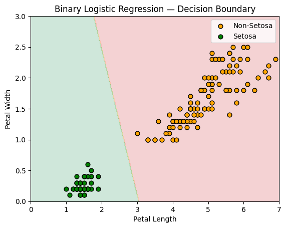
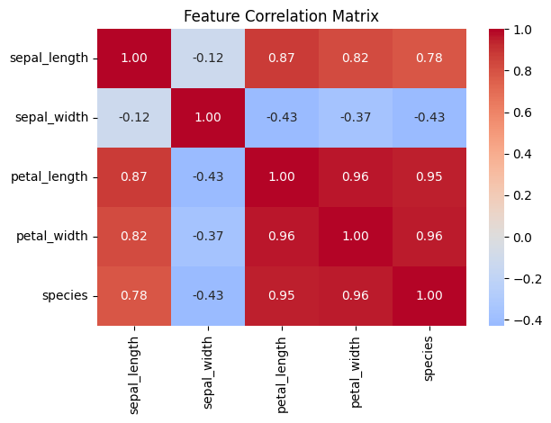
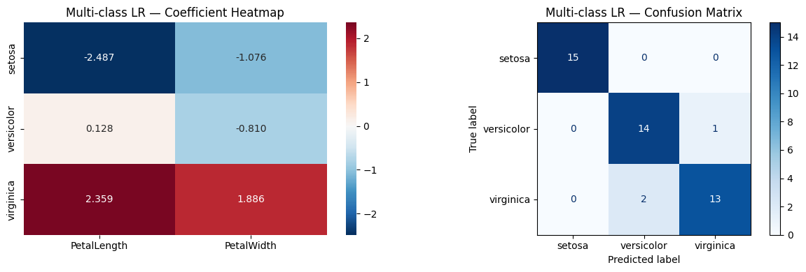
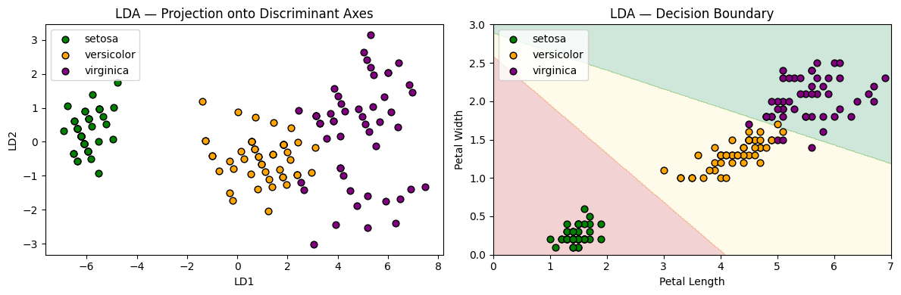
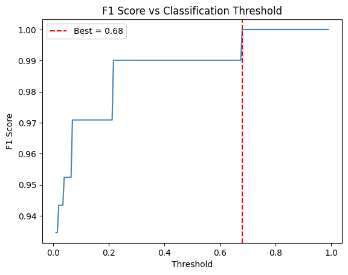
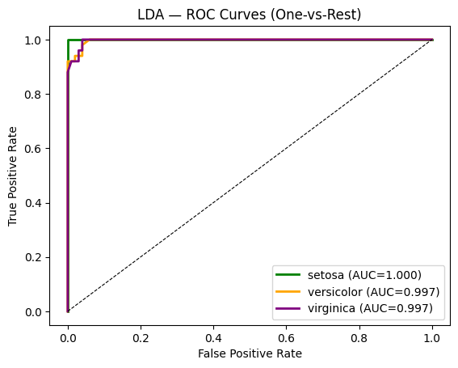
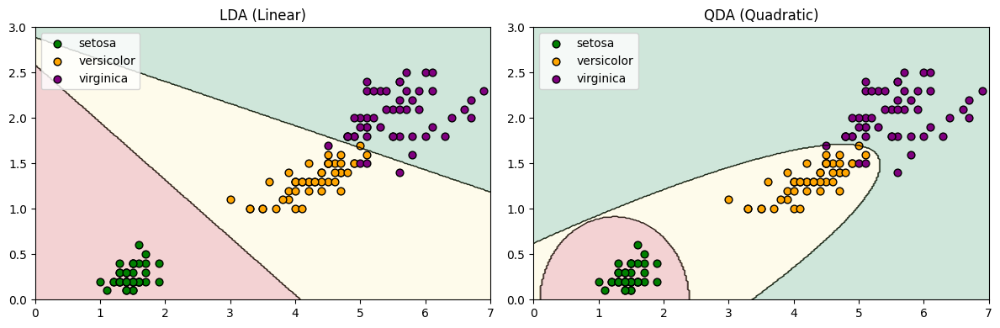
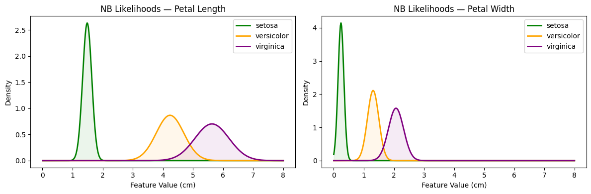
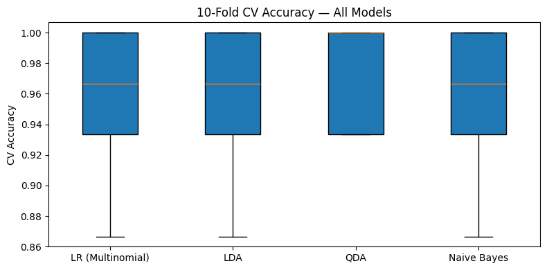
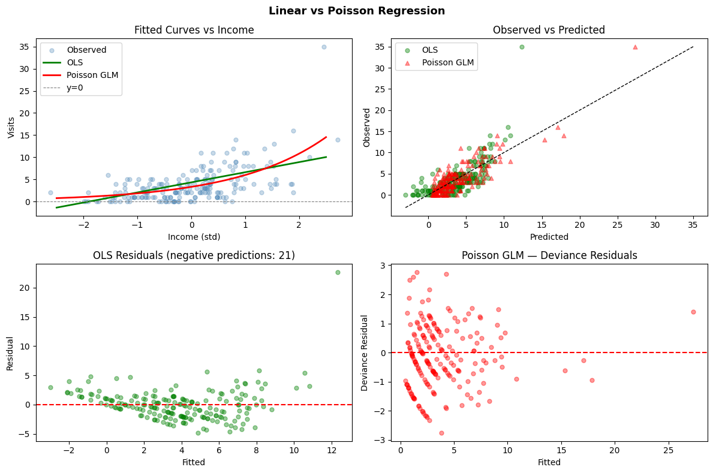

# Iris Classification Lab
**Logistic Regression · LDA · QDA · Naive Bayes · Poisson Regression**

> **Authors:** Jafar & Asmar  
> **Dataset:** Iris (Fisher, 1936) — 150 samples · 4 features · 3 classes · 70/30 stratified split

## 1. Motivation

Which classifier best separates the three Iris species? When does Poisson regression outperform OLS? We compare LR, LDA, QDA, and Naive Bayes on petal features, then evaluate OLS vs Poisson GLM on simulated count data.

## 2. Methods

Primary features: **Petal Length** and **Petal Width**.

| Model | Boundary | Key Assumption |
|---|---|---|
| Logistic Regression | Linear | None on X |
| LDA | Linear | Shared covariance Σ |
| QDA | Quadratic | Class-specific Σ_k |
| Naive Bayes | Non-linear | Feature independence |
| OLS | Identity link | Gaussian errors, ŷ unbounded |
| Poisson GLM | Log link | Poisson errors, ŷ ≥ 0 always |

## 3. Experiments & Results

### 3.1 Binary Logistic Regression (Setosa vs Rest) — Acc: **1.0**

```
              Coef      Std. Error   z-stat    p-Value   Sig.
const        61.1055   21221.57      0.0029    0.9977    ns
petal_length -17.8041  18322.80     -0.0010    0.9992    ns
petal_width  -23.2555  36408.40     -0.0006    0.9995    ns
```

### 3.2 Confounding Variables


```
Correlation with Setosa:  petal_length −0.923 · petal_width −0.887
                          sepal_length −0.717 · sepal_width  +0.603
Coefficient shift:         Petal-only     Full model
petal_length               −17.8041       −20.5324  (−15%)
petal_width                −23.2555       −14.9497  (−36%) ← confounding
```

Adding sepal features shifts `petal_width` by 36% — confirming partial confounding — without improving test accuracy. Petal-only model preferred.

### 3.3 Multi-Class LR (Softmax) — Acc: **0.9333**

```
Coefficients:   PetalLength  PetalWidth    Confusion Matrix (n=45):
setosa           −2.4869      −1.0758      Set [ 15  0  0 ]
versicolor        0.1279      −0.8098      Ver [  0 14  1 ]
virginica         2.3590       1.8856      Vir [  0  2 13 ]  ← all errors in Ver/Vir overlap
```

### 3.4 LDA — Acc: **0.9111** · Explained variance: [0.9945, 0.0055]

LD1 captures 99.45% of between-class variance. LDA is weakest because shared-Σ assumption is violated — Virginica det(Σ) is 93× Setosa's.

### 3.5 Threshold Optimisation — optimal: **0.68** (F1 = 1.0000)


### 3.6 ROC Curves (One-vs-Rest, LDA)

```
setosa AUC = 1.0000 · versicolor AUC = 0.9970 · virginica AUC = 0.9970 · Macro = 0.9980
```

### 3.7 QDA — Acc: **0.9333**

```
Σ_k matrices:   Setosa     [0.0236 0.0038 / 0.0038 0.0095]  det = 0.000209  ← tight
                Versicolor  [0.2177 0.0658 / 0.0658 0.0367]  det = 0.003637
                Virginica   [0.3322 0.0493 / 0.0493 0.0657]  det = 0.019560  ← 93× spread
```

Class-specific Σ_k captures heterogeneous dispersion — explaining QDA's edge over LDA.

### 3.8 Naive Bayes — Acc: **0.9333**


```
Class       Prior   PL μ    PL σ²   PW μ    PW σ²
setosa     0.3333  1.4857  0.0229  0.2400  0.0093
versicolor 0.3333  4.2371  0.2115  1.3086  0.0356
virginica  0.3333  5.6314  0.3227  2.0686  0.0639
```

PL/PW correlation ≈ 0.96 violates independence, yet NB matches LR and QDA — class means are far enough apart that the assumption causes minimal harm.

### 3.9 Model Comparison (10-Fold CV)




```
                  CV Mean  CV Std  Test Acc  Boundary   Cov. Assumption
LR (Multinomial)  0.9600   0.0442   0.9333  Linear     None
LDA               0.9600   0.0442   0.9111  Linear     Shared Σ      ← weakest
QDA               0.9733   0.0327   0.9333  Quadratic  Class Σ_k     ← best CV
Naive Bayes       0.9600   0.0442   0.9333  Non-linear Diagonal
```

**Baseline** (NB, 93.3%) matched by LR and QDA; LDA is the only model below it.  
**Negative result:** sepal features increased multicollinearity without improving accuracy.

### 3.10 Poisson vs Linear Regression
Simulated: visits ~ Poisson(exp(1.2 + 0.6·income − 0.4·age)), n=200. Mean=3.75, Var=15.12.

```
                OLS        Poisson GLM   True β
const          4.3252       1.1956        1.2  ✓
income         2.2839       0.5924        0.6  ✓
age           -1.5130      -0.4148       -0.4  ✓
IRR:                        income 1.808× · age 0.661×
                   OLS (Linear)   Poisson GLM
MSE                    7.141          3.739   (−48%)
MAE                    1.829          1.487
Negative predictions      21 ⚠           0   ✓
AIC                    966.8          769.8
Suitable for counts      No ❌        Yes ✅
```
Poisson GLM recovers the true log-scale DGP coefficients. OLS produces 21 negative visit predictions — invalid for count data. Overdispersion (var/mean ≈ 4) suggests Negative Binomial as a further improvement.


## 5. Team Contributions
| Member | Steps | Key Contributions |
|---|---|---|
| **Jafar** | 2, 3, 4, 5 | LDA (LD projection, threshold sweep, ROC); QDA (per-class Σ); Naive Bayes (parameters, likelihood viz); 10-fold CV, confusion matrices; Poisson GLM & OLS fitting, IRR analysis; method & experiments sections |
| **Asmar** | 1, 3, 4, 5 | Binary & multi-class LR; confounding analysis (correlation, coefficient shift); Naive Bayes; CV & model comparison; count data simulation, OLS & Poisson GLM; motivation & error analysis sections |
